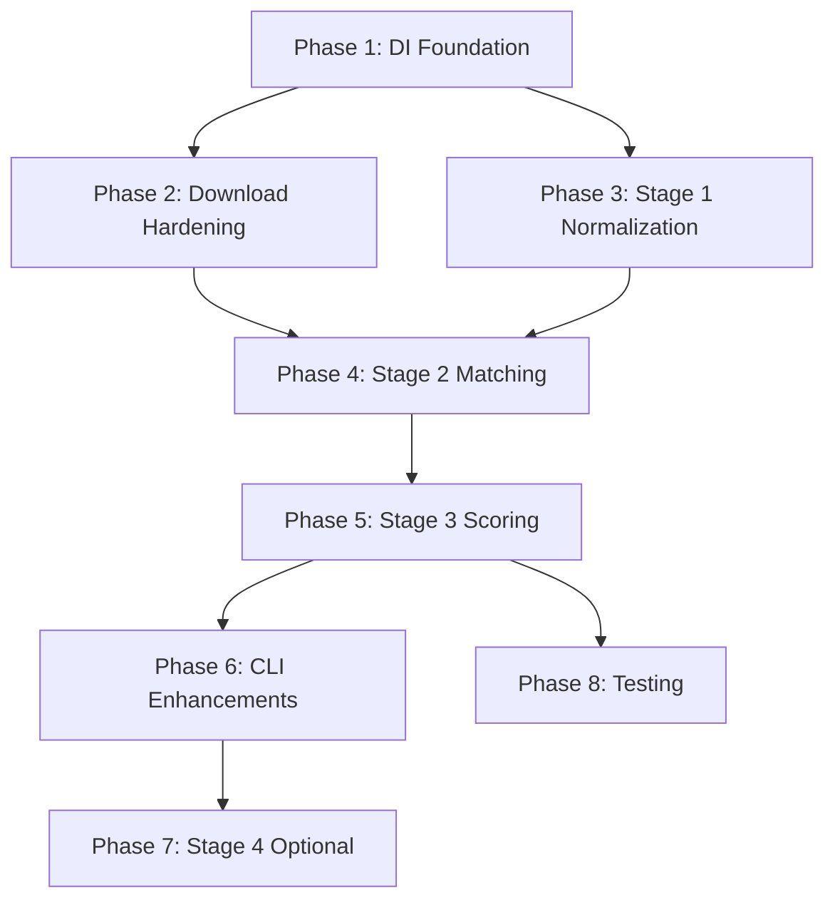

# UK Sponsor Pipeline Enhancement Plan

Transform the existing pipeline into a robust, testable, resumable system that produces a high-signal shortlist for senior engineering roles requiring UK visa sponsorship.

---

## Design Principles

1. **Dependency Injection** – All IO (HTTP, filesystem, config) injected for isolated testing
2. **Test-Driven Development** – Tests written before implementation; fixtures for golden-path validation
3. **Idiomatic Data Science** – pandas for transforms, explicit schema contracts, staged outputs
4. **Explainability** – Every shortlisted company traceable through all pipeline stages
5. **Resumability** – Stage 2 can checkpoint/resume; no lost work on interruption

---

## Proposed Changes

### Phase 1: Foundation – Dependency Injection & Testing Infrastructure

#### [NEW] [config.py](file:///Users/jim/code/personal/uk_sponsor_tech_hiring_pipeline_repo/src/uk_sponsor_pipeline/config.py)

Centralized, injectable configuration:

```python
@dataclass(frozen=True)
class PipelineConfig:
    ch_api_key: str
    ch_sleep_seconds: float = 0.2
    ch_min_match_score: float = 0.72
    ch_search_limit: int = 10
    tech_score_threshold: float = 0.55
    geo_filter_regions: list[str] | None = None  # e.g. ["London", "Manchester"]
    geo_filter_postcodes: list[str] | None = None  # e.g. ["EC", "SW", "M1"]

    @classmethod
    def from_env(cls) -> "PipelineConfig": ...
```

#### [NEW] [protocols.py](file:///Users/jim/code/personal/uk_sponsor_tech_hiring_pipeline_repo/src/uk_sponsor_pipeline/protocols.py)

Abstract interfaces for testability:

```python
class HttpClient(Protocol):
    def get_json(self, url: str, cache_key: str | None = None) -> dict: ...

class Cache(Protocol):
    def get(self, key: str) -> dict | None: ...
    def set(self, key: str, value: dict) -> None: ...

class FileSystem(Protocol):
    def read_csv(self, path: Path) -> pd.DataFrame: ...
    def write_csv(self, df: pd.DataFrame, path: Path) -> None: ...
    def read_json(self, path: Path) -> dict: ...
    def write_json(self, data: dict, path: Path) -> None: ...
```

#### [NEW] [tests/conftest.py](file:///Users/jim/code/personal/uk_sponsor_tech_hiring_pipeline_repo/tests/conftest.py)

Pytest fixtures with mock implementations:

- `FakeHttpClient` – returns canned responses
- `InMemoryCache` – dict-backed cache  
- `InMemoryFileSystem` – dict-backed filesystem
- Golden fixture CSVs in `tests/fixtures/`

---

### Phase 2: Download Stage Hardening

#### [MODIFY] [download.py](file:///Users/jim/code/personal/uk_sponsor_tech_hiring_pipeline_repo/src/uk_sponsor_pipeline/stages/download.py)

Changes:

1. Add `--url` CLI override (bypass scraping)
2. Validate CSV schema after download (required columns present)
3. Compute SHA256 hash, include in manifest
4. Add `downloaded_file_hash` to manifest JSON
5. Prefer link text matching "Worker and Temporary Worker" pattern

```python
def download_latest(
    url_override: str | None = None,
    data_dir: Path = Path("data/raw"),
    reports_dir: Path = Path("reports"),
    http_client: HttpClient | None = None,
) -> DownloadResult:
    """Returns DownloadResult with path, hash, and validation status."""
```

#### [NEW] [schemas.py](file:///Users/jim/code/personal/uk_sponsor_tech_hiring_pipeline_repo/src/uk_sponsor_pipeline/schemas.py)

Column contracts for each stage:

```python
RAW_REQUIRED_COLUMNS = ["Organisation Name", "Town/City", "County", "Type & Rating", "Route"]
STAGE1_OUTPUT_COLUMNS = [...]
STAGE2_OUTPUT_COLUMNS = [...]
```

---

### Phase 3: Stage 1 – Name Normalization & Stats

#### [MODIFY] [stage1.py](file:///Users/jim/code/personal/uk_sponsor_tech_hiring_pipeline_repo/src/uk_sponsor_pipeline/stages/stage1.py)

Changes:

1. Add `org_name_raw` (original) and `org_name_normalized` columns
2. Normalization includes: lowercase, suffix stripping (Ltd, Limited, PLC, LLP), punctuation removal
3. Aggregate by `org_name_normalized` but preserve all `org_name_raw` variants
4. Output stats JSON: row counts, duplicates, top 10 towns/counties

```python
def normalize_org_name(name: str) -> str:
    """Strip suffixes, punctuation, normalize whitespace."""

def run_stage1(
    raw_dir: Path,
    out_path: Path,
    reports_dir: Path,
    fs: FileSystem | None = None,
) -> Stage1Result:
    """Returns Stage1Result with path and stats."""
```

#### [NEW] [tests/test_stage1.py](file:///Users/jim/code/personal/uk_sponsor_tech_hiring_pipeline_repo/tests/test_stage1.py)

Test cases:

- `normalize_org_name("ACME LIMITED")` → `"acme"`
- `normalize_org_name("Foo & Bar (UK) Ltd.")` → `"foo bar uk"`
- Aggregation preserves raw names
- Stats JSON structure

---

### Phase 4: Stage 2 – Matching Quality & Resumability

This is the most critical phase.

#### [MODIFY] [stage2_companies_house.py](file:///Users/jim/code/personal/uk_sponsor_tech_hiring_pipeline_repo/src/uk_sponsor_pipeline/stages/stage2_companies_house.py)

##### 4.1 Name Preprocessing

```python
def generate_query_variants(org_name: str) -> list[str]:
    """Generate alternate search queries:
    1. Original name
    2. Strip "T/A" / "trading as" prefix
    3. Extract bracketed content: "Foo (Bar Ltd)" → try "Foo", "Bar"
    4. Split on " - ", " / " delimiters
    """
```

##### 4.2 Multi-Query Strategy

- Try up to 3 query variants
- Stop early if high-confidence match found (score ≥ 0.85)
- Track which query variant yielded the match

##### 4.3 Match Score Transparency

```python
@dataclass
class MatchScore:
    total: float
    name_similarity: float      # Jaccard + char overlap
    locality_bonus: float       # Town match
    region_bonus: float         # County match  
    status_bonus: float         # Active company
    confidence_band: str        # "high" | "medium" | "low"
```

Confidence bands:

- **high**: score ≥ 0.85
- **medium**: 0.72 ≤ score < 0.85
- **low**: score < 0.72 (but still best available)

##### 4.4 Resumability

```python
def run_stage2(
    stage1_path: Path,
    out_dir: Path,
    checkpoint_path: Path | None = None,  # Enables resume
    http_client: HttpClient | None = None,
    config: PipelineConfig | None = None,
) -> Stage2Result:
```

Implementation:

1. On start, load existing `stage2_enriched.csv` if exists
2. Build set of already-processed org names
3. Skip orgs already enriched
4. Append new results incrementally (or checkpoint every N orgs)
5. On completion, rewrite final sorted output

##### 4.5 Cache Key Improvement

```python
def cache_key(prefix: str, *parts: str) -> str:
    """Normalize whitespace, lowercase, then hash."""
    normalized = "_".join(p.strip().lower() for p in parts)
    return f"{prefix}:{hashlib.sha256(normalized.encode()).hexdigest()[:16]}"
```

##### 4.6 Rate Limit Budget

```python
@dataclass
class RateLimitState:
    requests_this_minute: int = 0
    minute_start: float = 0.0
    max_rpm: int = 600  # Companies House limit

    def wait_if_needed(self) -> None: ...
```

#### [NEW] [tests/test_stage2.py](file:///Users/jim/code/personal/uk_sponsor_tech_hiring_pipeline_repo/tests/test_stage2.py)

Test cases:

- Query variant generation: "Foo T/A Bar" → ["Foo T/A Bar", "Bar"]
- Match scoring components
- Resumability: partial run + resume completes correctly
- Cache key normalization

---

### Phase 5: Stage 3 – Composable Scoring Model

#### [MODIFY] [stage3_scoring.py](file:///Users/jim/code/personal/uk_sponsor_tech_hiring_pipeline_repo/src/uk_sponsor_pipeline/stages/stage3_scoring.py)

Replace single SIC heuristic with additive feature model:

```python
@dataclass
class ScoringFeatures:
    sic_tech_score: float       # 0.0–0.5 (SIC-derived tech signal)
    is_active: float            # 0.0 or 0.1
    company_age_score: float    # 0.0–0.15 (young companies: 0, established: 0.15)
    company_type_score: float   # 0.0–0.1 (ltd: 0.05, plc: 0.02, charity: 0.0)
    name_keyword_score: float   # 0.0–0.15 (presence of "software", "digital", etc.)
    
    @property
    def total(self) -> float:
        return min(1.0, sum([
            self.sic_tech_score,
            self.is_active,
            self.company_age_score,
            self.company_type_score,
            self.name_keyword_score,
        ]))
    
    @property
    def bucket(self) -> str:
        if self.total >= 0.65: return "strong"
        if self.total >= 0.45: return "possible"
        return "unlikely"
```

##### Explainability Output

New artefact: `stage3_explain.csv`

| org_name | sic_score | active_score | age_score | type_score | keyword_score | total | bucket |
|----------|-----------|--------------|-----------|------------|---------------|-------|--------|

##### Name Keyword Signals

```python
TECH_KEYWORDS = {"software", "digital", "tech", "data", "ai", "cloud", "cyber", "app", "platform"}
NEGATIVE_KEYWORDS = {"care", "nursing", "recruitment", "staffing", "construction"}
```

#### [NEW] [tests/test_stage3.py](file:///Users/jim/code/personal/uk_sponsor_tech_hiring_pipeline_repo/tests/test_stage3.py) (expand existing)

Test cases:

- Feature extraction for known companies
- Bucket assignment thresholds
- Keyword detection

---

### Phase 6: CLI Enhancements

#### [MODIFY] [cli.py](file:///Users/jim/code/personal/uk_sponsor_tech_hiring_pipeline_repo/src/uk_sponsor_pipeline/cli.py)

##### Geographic Filtering

```bash
# Filter by region names (case-insensitive, partial match)
uk-sponsor stage3 --region London --region Manchester

# Filter by postcode prefixes
uk-sponsor stage3 --postcode-prefix EC --postcode-prefix SW

# Combine with threshold override
uk-sponsor stage3 --region London --threshold 0.60
```

##### Other CLI Improvements

```bash
# Download with URL override
uk-sponsor download --url https://assets.../2026-01-29_-_Worker.csv

# Resume Stage 2 (default: auto-resume if checkpoint exists)
uk-sponsor stage2 --resume

# Dry-run: show what would happen without writing
uk-sponsor stage1 --dry-run

# Run all stages sequentially
uk-sponsor run-all --region London
```

##### CLI Structure

```python
@app.command()
def stage3(
    threshold: float = typer.Option(None, help="Override TECH_SCORE_THRESHOLD"),
    region: list[str] = typer.Option([], help="Filter by region (repeatable)"),
    postcode_prefix: list[str] = typer.Option([], help="Filter by postcode prefix"),
):
```

---

### Phase 7: Stage 4 (Optional) – Web Presence Enrichment

Only runs on Stage 3 shortlist to limit API calls.

#### [NEW] [stage4_web_presence.py](file:///Users/jim/code/personal/uk_sponsor_tech_hiring_pipeline_repo/src/uk_sponsor_pipeline/stages/stage4_web_presence.py)

Lightweight signals:

1. **Website domain** – Extract from Companies House if available, else skip
2. **LinkedIn exists** – HEAD request to `linkedin.com/company/{name-slug}`
3. **GitHub org exists** – HEAD request to `github.com/{name-slug}`

```python
@dataclass
class WebPresence:
    has_website: bool | None
    website_domain: str | None
    linkedin_exists: bool | None
    github_exists: bool | None
    enriched_at_utc: str
```

Output: `stage4_final_shortlist.csv` (hundreds of rows, not thousands)

---

### Phase 8: Testing Strategy

#### Test Pyramid

```
┌─────────────────────────────────────────┐
│        Integration Tests (few)          │  ← Full pipeline on tiny fixtures
├─────────────────────────────────────────┤
│         Unit Tests (many)               │  ← Pure functions, injected deps
└─────────────────────────────────────────┘
```

#### Fixtures

```
tests/fixtures/
├── raw_sponsor_sample.csv       # 10 rows covering edge cases
├── stage1_expected.csv          # Golden output for sample
├── ch_search_response.json      # Canned API response
├── ch_profile_response.json     # Canned API response
└── stage3_expected_explain.csv  # Golden scoring output
```

#### Key Test Files

| File | Coverage |
|------|----------|
| `test_normalization.py` | `normalize_org_name`, `generate_query_variants` |
| `test_matching.py` | Score calculation, confidence bands |
| `test_scoring.py` | Feature extraction, bucket assignment |
| `test_cli.py` | CLI argument parsing, option combinations |
| `test_integration.py` | End-to-end on fixtures |

---

## Verification Plan

### Automated Tests

```bash
# Run all tests with coverage
pytest --cov=uk_sponsor_pipeline --cov-report=term-missing

# Type checking
mypy src/

# Linting
ruff check src/ tests/
ruff format --check src/ tests/
```

### Manual Verification

1. **Download**: Run `uk-sponsor download` → verify manifest contains hash
2. **Stage 1**: Run on full dataset → verify stats JSON, normalized names
3. **Stage 2**:
   - Run partial → interrupt → resume → verify no duplicates
   - Spot-check 10 matches manually against Companies House website
4. **Stage 3**:
   - Review `stage3_explain.csv` for top 50 companies
   - Verify bucket assignments match feature scores
5. **Geographic filter**: Run with `--region London` → verify all results have London postcode/region
6. **Final shortlist size**: Should be < 1000 for national, < 200 for London

---

## File Summary

| Action | File | Purpose |
|--------|------|---------|
| NEW | `config.py` | Centralized, injectable config |
| NEW | `protocols.py` | Abstract interfaces for DI |
| NEW | `schemas.py` | Column contracts per stage |
| NEW | `stage4_web_presence.py` | Optional web presence enrichment |
| MODIFY | `download.py` | Hash, validation, URL override |
| MODIFY | `stage1.py` | Name normalization, stats output |
| MODIFY | `stage2_companies_house.py` | Multi-query, resumability, transparency |
| MODIFY | `stage3_scoring.py` | Composable features, explainability |
| MODIFY | `cli.py` | Geographic filtering, threshold override |
| NEW | `tests/conftest.py` | Shared fixtures and mocks |
| NEW | `tests/test_normalization.py` | Name processing tests |
| NEW | `tests/test_matching.py` | CH matching tests |
| EXPAND | `tests/test_stage3.py` | Scoring tests |
| NEW | `tests/test_integration.py` | End-to-end tests |
| NEW | `tests/fixtures/` | Golden test data |

---

## Implementation Order



Recommended sequence:

1. **Phase 1** first (enables all other testing)
2. **Phases 2–3** in parallel (independent)
3. **Phase 4** after Phase 3 (depends on normalized names)
4. **Phase 5** after Phase 4 (depends on enriched data)
5. **Phase 6** alongside Phase 5 (CLI changes support both)
6. **Phase 7** last (runs on shortlist only)
7. **Phase 8** throughout (TDD approach)
