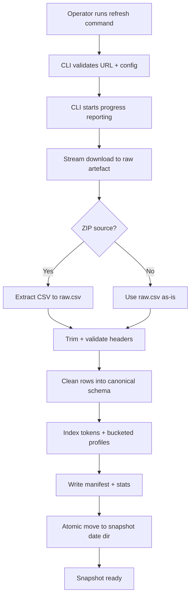
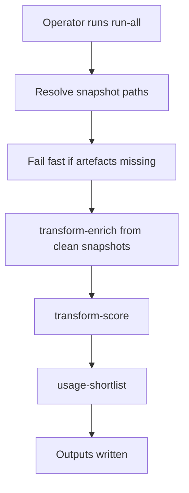

# Refresh and Cache-Only Run Diagrams

This document provides the flow diagrams for refresh commands and cache-only `run-all`.

## Refresh Flow (Snapshot Generation)

## Cache-Only `run-all` Flow

Notes:
- Refresh commands may use network IO; `run-all` does not.
- Cache-only runs consume clean snapshots only and never read raw artefacts.
